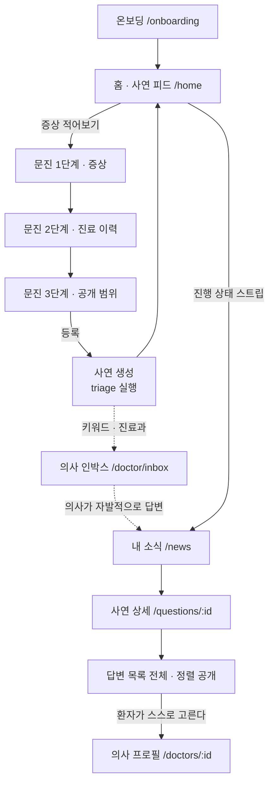
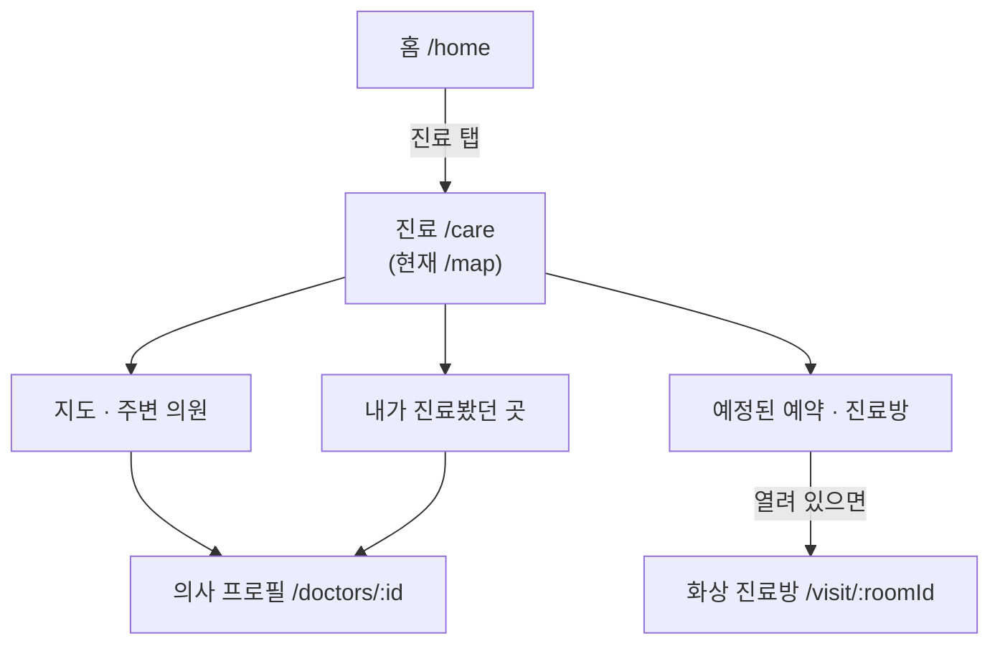
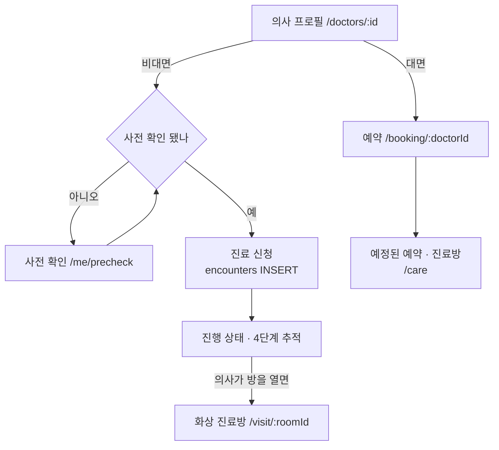
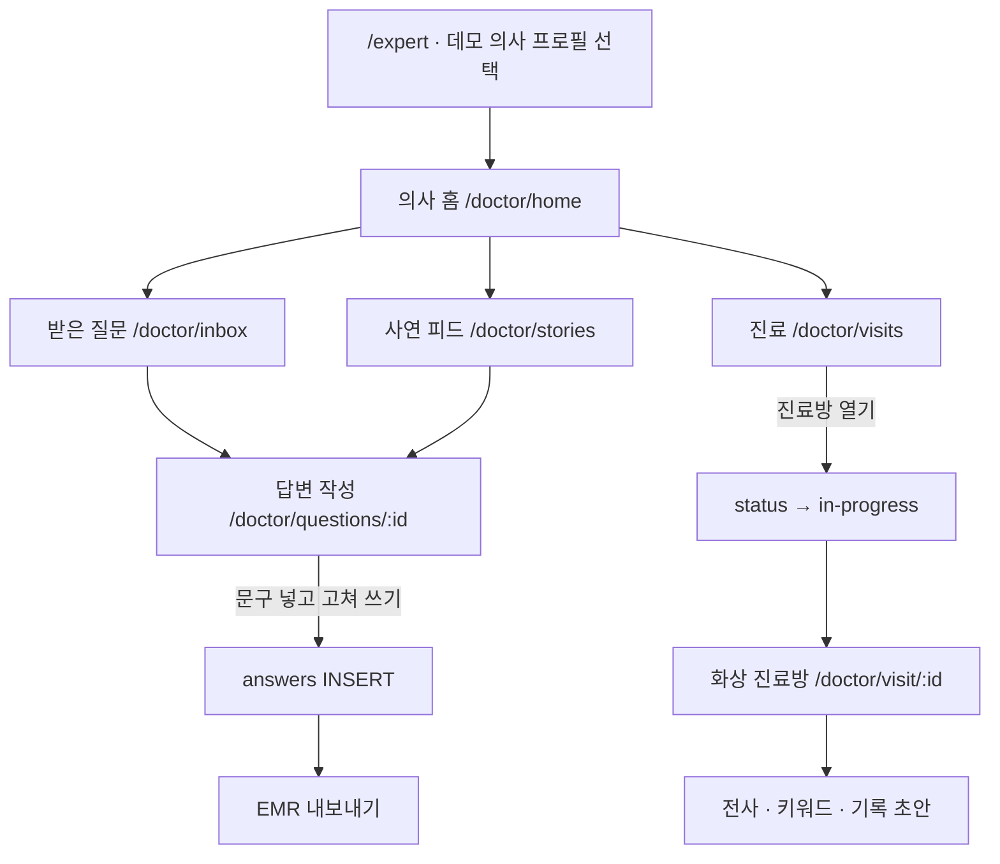
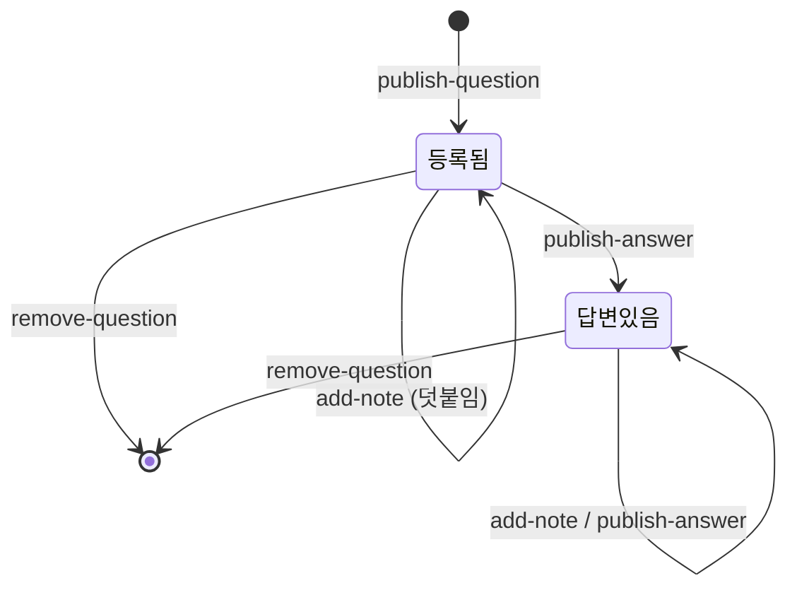
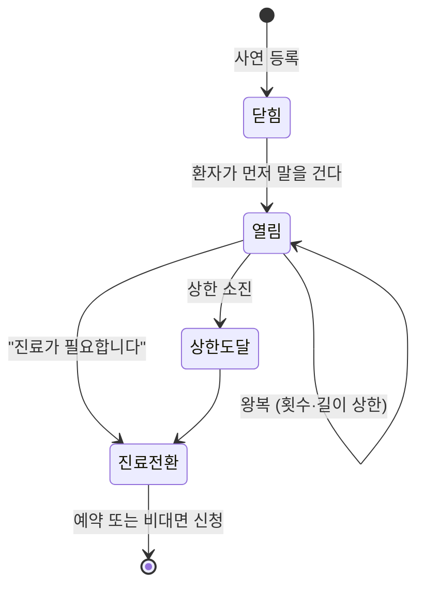
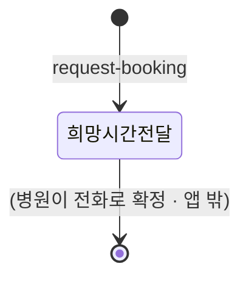
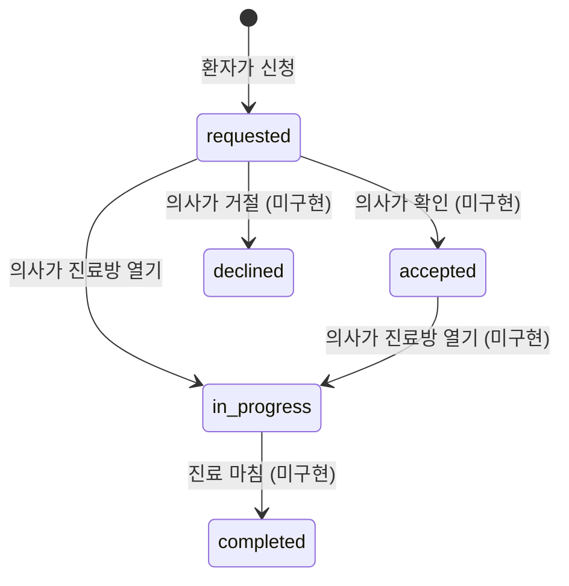
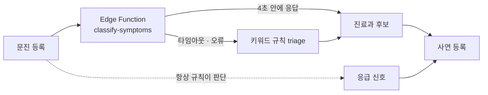

# 20 · 유저 플로우와 상태 전이

> 화면 단위 상세는 `30-feature-spec.md`. 이 문서는 화면 **사이**를 다룬다.
> 위치와 계층은 `15-information-architecture.md`. 이 문서는 그 위를 지나가는 순서를 다룬다.
> 마지막 대조: 2026-08-27 · 대상 커밋 `f018a58`

## 환자는 두 상태 중 하나로 들어온다

`05-decisions.md` D-5 · IA-1. **상태가 다르면 지나가는 화면이 다르다.** 한 흐름으로 그리면 둘 다 흐려진다.

| | 진입로 A · 의사 찾기 | 진입로 B · 주변 · 재진 |
| --- | --- | --- |
| 환자 상태 | 볼 의사를 **모른다** | 볼 의사를 **안다** |
| 시작점 | 사연을 쓴다 | 지도 · 내가 진료봤던 곳 |
| 걸리는 시간 | 답변을 기다린다 (비동기) | 즉시 |
| 홈 기본값 | **예** (D-5) | 아니오 |

**두 흐름은 `의사 프로필`에서 합류한다.** 예약·비대면 신청은 거기서만 시작한다 — 답변 본문 안에 예약 버튼을 두지 않는다 (`00-product-definition.md` 원칙 4).

> **라우트 이름 주의.** 아래 흐름은 D-5와 Q-1(둘 다 닫힘)을 따른다 — `/home`은 사연 피드, `/care`는 주변·재진 탭이다. **현재 코드는 아직 그렇지 않다.** `/home`이 대시보드이고 주변 진료는 `/map`이며 `/care`는 없다. 이 문서는 가야 할 곳을, 코드는 지금 있는 곳을 말한다.

## 진입로 A · 의사 찾기 — 볼 의사를 모른다

**매칭은 사연에서 의사 쪽으로만 흐른다.** 사연이 의사 인박스에 배달되고, 답변할지는 의사가 정하고, 고르는 것은 환자가 모인 답변 전체에서 한다. **환자에게 의사를 골라 주는 반대 방향 화살표는 이 그림에 없다** — `05-decisions.md` C-2. 없는 흐름은 실수로 만들어질 수 없다.

의사가 실제로 답변하러 오는지는 **아직 잰 적 없다** — 가설 H-2. 이 흐름의 점선 두 개가 그 가설 위에 있다.

## 진입로 B · 주변 · 재진 — 볼 의사를 안다

**이 진입로는 사연을 지나지 않는다.** 갈 곳을 아는 환자에게 게시판은 한 단계가 더 생기는 것이고, 그 비용은 홈의 진행 상태 스트립이 갚는다 (D-5).

**"내가 진료봤던 곳"에는 출처가 둘이다** (Q-4 닫힘) — 앱 내 이력(`bookings`·`encounters`에서 자동)과 환자 직접 등록(수동). 앱 내 이력만 두면 새 사용자에게 이 진입로가 처음부터 비어 있어서 직접 등록을 연다. **두 출처는 화면에서 등급을 구분해 표시하고 섞지 않는다.** 의료기관 연계를 통한 "불러오기"는 자리만 남기고 지금 만들지 않는다.

## 합류점 — 의사 프로필에서 진료로

**예약 목록은 `/care` 한 곳이다** (Q-2 닫힘). `/me/appointments`는 `/care`로 흡수하고 리다이렉트만 남긴다 — 기존 링크와 북마크가 살아 있어야 한다.

## 지금 홈이 무엇을 세우는가

**현재 코드에서는 `nextStep.ts`의 `resolveNextStep`이 홈 전체를 정한다.** 우선순위는 뒤에서부터다 — 예약이 잡혀 있으면 그것이 가장 급한 정보다.

| 순위 | `kind` | 조건 |
| --- | --- | --- |
| 1 | `booked` | 예약이 있다 |
| 2 | `first-visit` | 내 사연이 없다 |
| 3 | `answered` / `waiting` | 최신 사연에 답변이 있나 없나 |

진행 중인 비대면 신청은 별도로 `activeEncounter`가 골라 홈에 세운다. **진료방이 열린 것이 있으면 그것부터** — 저쪽에서 사람이 기다리는 쪽이 급하다.

D-5가 홈을 사연 피드로 바꾸면 **이 판정이 진행 상태 스트립으로 옮겨 간다.** 새로 계산할 것은 없다 — 같은 함수가 더 얇은 자리에 붙는다.

## 의사 종단 흐름

**D-1이 Q&A를 축으로 정했으므로 `받은 질문`이 의사 앱의 중심이다.** 의사에게 무엇이 보이는지는 `doctorFeed.ts`가 정하고, 왜 걸렸는지(`specialty` / `keyword`)를 함께 붙인다. 진료 신청은 사연 목록에 섞지 않고 홈 맨 위와 진료 탭 두 곳에 따로 세운다 — 저쪽에서 사람이 기다리는 일이기 때문이다.

정렬 규칙: **응급 신호가 걸린 사연만 맨 위로.** 나머지는 원래 순서(최신순)를 그대로 둔다. 우리가 정한 기준으로 줄을 세우기 시작하면 그게 곧 노출 우선권이 된다.

## 두 정체성

계정 하나가 환자와 의사 두 자리에 앉는다. `/expert`에서 준비된 의사 프로필을 고르면 `role`이 바뀐다.

- 화면에 서는 이름 = **고른 의사 페르소나의 이름** (`liveMappers.ts:198`)
- `display_name` = 환자로 돌아갈 때 쓰는 이름. 건드리지 않는다
- 두 정체성이 다르다는 사실은 숨기지 않고 의사 MY에 적는다

> 스냅샷을 다시 읽을 때 **직접 고른 화면을 덮지 않는다.** 사연을 하나 올리면 곧바로 다시 읽으므로, 이 보호가 없으면 의사 계정으로 환자 화면을 보던 사람이 글을 쓰는 도중 의사 화면으로 튕긴다.

## 상태 전이

### 사연 (`questions`)

**사연에는 상태 컬럼이 없다.** "답변있음"은 `answers`에 행이 있느냐로만 결정된다. 등록 후 본문은 고치지 않는다 — 지나간 증상 설명이 조용히 바뀌면 그 위에 달린 답변이 무엇을 보고 쓴 것인지 알 수 없어진다. 대신 `question_notes`로 덧붙인다.

### 비공개 덧붙임 — D-6 닫힘

답변한 의사와의 1:1 후속이다. **경계를 문구가 아니라 구조로 강제한다.** 안내 문구만 두면 화면이 아무것도 막지 않으면서 막는다고 적는 것이 되고, 그건 원칙 6 위반이다.

| 강제 항목 | 무엇을 막나 |
| --- | --- |
| 환자가 먼저 말 걸어야 열린다 | 의사 쪽의 영업·유인 경로 |
| **답변한** 의사에게만 열린다 | 공개 기여 없이 개별 접촉하는 경로 |
| 왕복 횟수·길이 상한 | 사실상의 진료로 자라는 것 |
| 매 회신에 고정 고지 (의사가 못 지운다) | 진료로 오인 |
| 처방·진단·검사 지시 표현 입력 단계 필터 + 로그 보관 | 경계 이탈 · 양벌규정 방어 자료 |
| "진료가 필요합니다" 전환 상시 노출 | 비공개 대화를 진료의 대체재로 쓰는 것 |

**왜 이렇게까지 하나** — 공개 답변이 규제를 통과하는 이유는 불특정 다수를 향한 일반 정보이기 때문이다. 특정 환자를 향한 개별 조언이 되면 그 근거가 사라지고 원격의료(제34조) 또는 중개매체 규제로 들어간다.

구체 수치(왕복 횟수·길이·금지 표현)는 `30-feature-spec.md`에서 정하고 `src/data/rules/*`에 `asOf`와 함께 둔다 (원칙 7). **경계의 위치는 유권해석 대상이라 움직일 수 있으므로 수치를 코드에 박지 않는다.**

### 대면 예약 (`bookings`)

**`bookings`에는 상태 컬럼이 자체가 없다.** 앱이 하는 일은 희망 시간과 요청 서류를 전달하는 데서 끝난다. 확정·취소·변경은 앱 밖에서 일어난다. 화면 문구도 "예약 희망 시간을 전달했어요 · 병원 확인 후 확정됩니다"로 그 경계를 지킨다.

> 실제 예약 성사를 앱 안으로 들이려면 상태 컬럼과 병원 쪽 화면이 함께 필요하다. 60-roadmap 참조.

### 비대면 진료 신청 (`encounters`)

`encounterTrack.ts`가 이 상태를 환자용 4단계 추적으로 바꾼다: **신청함 → 의사 확인 → 진료방 열림 → 진료 마침.** 신청 버튼이 회색으로 변하는 것이 전부였을 때, 신청한 사람은 자기 요청이 살아 있는지 사라졌는지 알 수 없었다. 아픈 상태에서 그 모름은 그냥 불안이다.

`roomOpen`은 `status === 'in-progress'`일 때만 참이다. **의사가 열어야 들어간다.**

> ⚠️ **F-6 · 5개 상태 중 실제로 일어나는 전이는 하나뿐이다.**
> `setEncounterStatus`를 부르는 곳은 `DoctorVisitsScreen.tsx:98` 한 곳이고 항상 `'in-progress'`다. `accepted` · `completed` · `declined`는 **어디서도 설정되지 않는다.**
> 결과: 환자 추적 화면의 "의사 확인" 단계는 건너뛰어지고, 진료가 끝나도 신청이 영원히 `in-progress`로 남아 `activeEncounter`가 계속 홈에 세운다. 거절 문구는 작성돼 있으나 도달할 수 없다.
> 필요한 것: 의사 화면에 **확인 / 거절 / 진료 마침** 세 동작. 60-roadmap의 P0 후보.

## 권한이 실제로 갈리는 지점

화면이 아니라 **서버가 판단하는 곳**이다. 화면 쪽 판정은 사용자 경험을 위한 것이다.

| 지점 | 무엇이 막는가 |
| --- | --- |
| 사연이 의사에게 보이나 | `questions` RLS. 미검증 의사는 공개 글도 못 본다 |
| 답변을 쓸 수 있나 | `answers` INSERT 정책. 검증된 의사 + 그 사연이 나에게 보여야 함 |
| 진료방에 들어갈 수 있나 | `encounters` SELECT 정책. **내 목록에 없는 방은 내가 당사자가 아닌 방이다** |
| 시그널링 채널 구독 | ⚠️ **아직 안 막힌다.** 방 이름을 아는 사람은 구독할 수 있다 |

## 분류가 실패해도 흐름은 멈추지 않는다

- **응급 신호는 모델을 타지 않는다.** 규칙이 판단한다. 가슴 통증을 놓치는 일에 "모델이 그렇게 봤다"는 사후 설명은 쓸 수 없다.
- **근거 칩은 환자 글에 실제로 있던 말만.** 함수에서 한 번, 화면에서 한 번 거른다.
- **진료과 목록에 없는 값은 버린다.** 모델이 무엇을 뱉든 우리가 아는 모양만 통과시킨다.
- 증상 글이 모델 제공자에게 간다는 사실은 작성 화면에 적는다. 구현 세부가 아니라 **동의를 받아야 하는 사실**이다.
